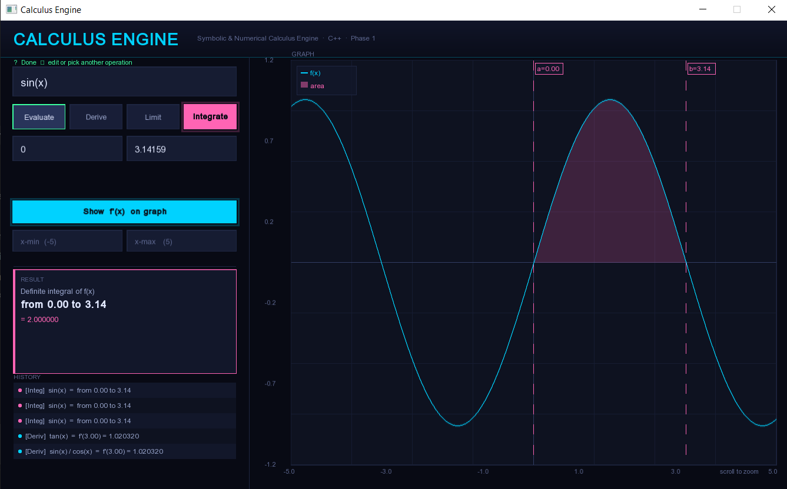
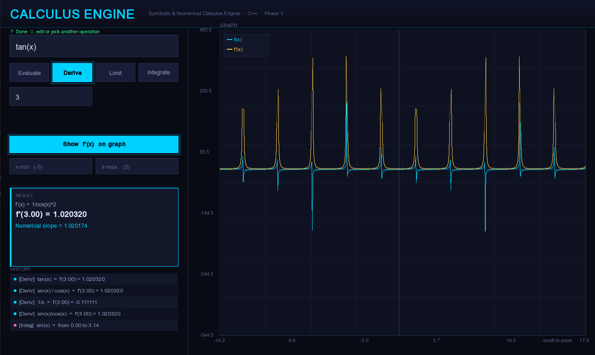
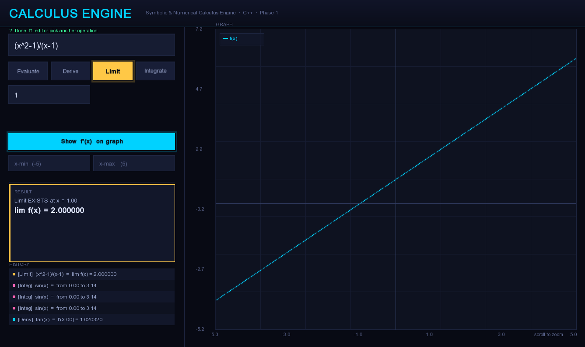
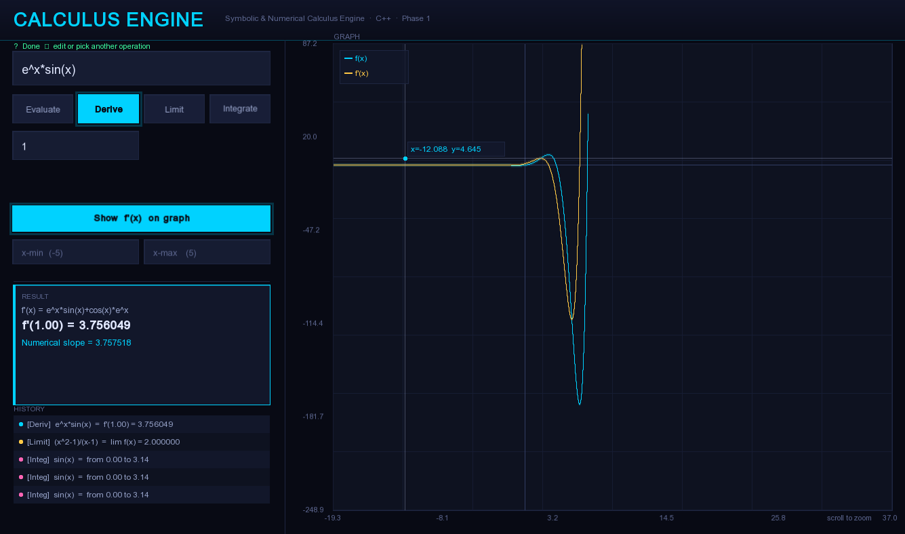

# CalcEngine ⚙️
> A symbolic and numerical Calculus Engine built from scratch in C++ with an SFML 3.0.2 GUI — no math libraries used for the core engine.

---

## What is CalcEngine?

CalcEngine is a Windows desktop application that parses, evaluates, differentiates, and integrates mathematical expressions. It was built entirely from scratch — including a custom tokenizer, recursive descent parser, Abstract Syntax Tree (AST), symbolic differentiator, AST simplifier, and expression printer — as a personal summer project to deeply understand both calculus and compiler theory.

No math libraries were used for the core engine. No AI autocomplete. Just C++, OOP, and first principles.

## Screenshots

<p align="center">
  
  <br/>
  <em>Integration with shaded region and dashed limit lines</em>
</p>

<p align="center">
  
  <br/>
  <em>Symbolic differentiation output</em>
</p>

<p align="center">
  
  <br/>
  <em>Another Example</em>
</p>

<p align="center">
  
  <br/>
  <em>Hyperolic Functions and there Graphs</em>
</p>

---

## Features

### ✅ Phase 1 — Single Variable Calculus (Version 1.0)

| Feature | Description |
|---|---|
| **Tokenizer** | Lexical analysis with dynamic multi-character function name handling |
| **Parser** | Recursive descent with full AST construction and BODMAS enforcement |
| **Evaluator** | Numerical evaluation of any expression at a given x, with full domain validation |
| **Limits** | Numerical left/right approach with existence check and value approximation |
| **Numerical Differentiation** | Derivative via limit definition `[f(x+h) - f(x)] / h` |
| **Symbolic Differentiation** | Exact derivative via AST transformation — power, sum, product, quotient, chain rules |
| **Integrator** | Riemann sum based numerical integration over `[a, b]` with 1000 intervals |
| **AST Simplifier** | Algebraic identity reduction and constant folding on derivative trees |
| **Expression Printer** | Precedence-aware textbook-style expression formatting |
| **SFML GUI** | Graph plotting, glow effects, mouse crosshair with live coordinates, scroll-wheel zoom anchored to cursor, drag panning, integration region shading with dashed limit lines, calculation history panel, step-based UX flow |

### 🔜 Phase 2 — Multivariable Calculus (Planned)
- Partial Derivatives
- Gradient Vector
- Green's Theorem
- Stokes' Theorem
- Divergence Theorem

---

## Supported Functions

| Category | Functions |
|---|---|
| Trigonometric | `sin`, `cos`, `tan`, `sec`, `csc`, `cot` |
| Inverse Trigonometric | `asin`, `acos`, `atan`, `asec`, `acsc`, `acot` |
| Hyperbolic | `sinh`, `cosh`, `tanh`, `sech`, `csch`, `coth` |
| Inverse Hyperbolic | `asinh`, `acosh`, `atanh`, `asech`, `acsch`, `acoth` |
| Logarithmic | `ln`, `log` |
| Miscellaneous | `sqrt`, `exp`, `e` |

---

## Domain Validation

CalcEngine validates mathematical domains before evaluation and displays meaningful error messages:

| Expression | Error |
|---|---|
| `ln(-1)` | Math error: ln undefined for x ≤ 0 |
| `sqrt(-4)` | Math error: sqrt undefined for x < 0 |
| `1/0` | Math error: division by zero |
| `asin(2)` | Math error: asin undefined for \|x\| > 1 |
| `acosh(0)` | Math error: acosh undefined for x < 1 |
| `atanh(1)` | Math error: atanh undefined for \|x\| >= 1 |

---

## Architecture

```
CalcEngine/
├── src/
│   ├── parser/
│   │   ├── Tokenizer.h/.cpp     ← Lexical analysis
│   │   └── Parser.h/.cpp        ← Recursive descent parser + AST
│   ├── calculus/
│   │   ├── Evaluator.h/.cpp     ← Numerical evaluation + domain validation
│   │   ├── Limits.h/.cpp        ← Limit computation
│   │   ├── Differentiator.h/.cpp← Symbolic + numerical differentiation
│   │   ├── Integrator.h/.cpp    ← Riemann sum integration
│   │   ├── Simplifier.h/.cpp    ← AST algebraic simplification
│   │   └── ExprPrinter.h/.cpp   ← Textbook-style expression formatting
│   └── ui/
│       ├── CalcUI.h             ← UI declarations
│       └── CalcUI.cpp           ← SFML GUI implementation
├── include/
├── tests/
└── main.cpp
```

---

## How It Works

### 1. Tokenizer
Breaks a raw string like `"3*x^2 + sin(x)"` into typed tokens — `NUMBER`, `VARIABLE`, `OPERATOR`, `FUNCTION`, `LPAREN`, `RPAREN` — using a dynamic while-loop for multi-character function names. Validates function names against a known list before the parser runs.

### 2. Parser
Implements recursive descent parsing with explicit precedence levels:
- `parseExpression()` → `+`, `-`
- `parseTerm()` → `*`, `/`
- `parsePower()` → `^`
- `parsePrimary()` → numbers, variables, functions, parentheses

Produces an AST where operator precedence is encoded in tree depth. Every level null-checks its children before proceeding.

### 3. Symbolic Differentiator
Walks the AST and applies calculus rules to produce a new expression tree. Never modifies the original tree — uses `copyTree()` for deep copies wherever shared pointers would otherwise occur.

Rules implemented:
- Power Rule: `d/dx xⁿ = n·xⁿ⁻¹`
- Sum/Difference Rule: `d/dx (f±g) = f' ± g'`
- Product Rule: `d/dx (fg) = f'g + fg'`
- Quotient Rule: `d/dx (f/g) = (f'g - fg') / g²`
- Chain Rule: `d/dx f(g(x)) = f'(g(x))·g'(x)`
- Full trig, hyperbolic, inverse trig, inverse hyperbolic, log, and exponential rules

### 4. AST Simplifier
Applies algebraic identities bottom-up in multiple passes until stable:
- `0+x → x`, `x+0 → x`, `x-0 → x`
- `1*x → x`, `x*1 → x`, `0*x → 0`
- `x/1 → x`, `x^1 → x`, `x^0 → 1`
- Constant folding: `2*3 → 6`, `4+5 → 9`

### 5. Expression Printer
Precedence-aware textbook formatting — adds parentheses only where required, handles unary negation (`-1*x → -x`), and formats numbers cleanly (no trailing `.000000`).

---

## Sample Results

```
f(x) = x^3
f'(x) = 3x^2
f'(2.00) = 12.000000
Numerical slope = 12.001000

f(x) = sin(x)^3
f'(x) = 3sin(x)^2*cos(x)
f'(1.00) = 1.147721

f(x) = sec(x) + tan(x)
f'(x) = sec(x)*tan(x) + 1/cos(x)^2
f'(2.00) = 5.250646

∫ x^2 dx from 0 to 3 ≈ 9.000000

lim(x→1) (x^2-1)/(x-1) = 2.000000
Limit EXISTS at x = 1.00
```

---

## Tech Stack

- **Language:** C++17
- **IDE:** Visual Studio Community 2022
- **GUI:** SFML 3.0.2
- **Libraries:** `<cmath>`, `<string>`, `<vector>` — standard only for core engine
- **Paradigm:** OOP — classes, encapsulation, recursion, dynamic memory, exception handling

---

## Error Handling

- Parser throws on unknown function names and invalid token sequences
- Evaluator throws descriptive messages on domain violations
- All exceptions caught at every level — UI always shows a message, never crashes
- Graph silently skips undefined sample points without breaking the render loop
- `main()` catches all exception types including `std::string` and `const char*`

---

## CI/CD: Windows Desktop Downloads

- On every push and pull request, GitHub Actions builds a Windows executable and uploads it as the **`CalcEngine-windows-exe`** artifact.
- To test quickly: open the workflow run in the **Actions** tab, then download the **`CalcEngine-windows-exe`** artifact and run `CalcEngine.exe`.

### Release download (recommended)

1. Push a tag like `v1.0.0`.
2. Open the repo **Releases** page.
3. Open release **v1.0.0**.
4. Under **Assets**, click **CalcEngine-Setup.exe** for one-click install (or `CalcEngine.exe` for portable use).

For safer use, download only from this repository’s official **Releases** page (not re-uploaded third-party links).

---

## Built By

**Mubashir** — 1st Year CS Student, FAST NUCES Lahore (Batch 2025)

Built during summer break as a self-driven deep-dive into calculus and compiler theory. GitHub Copilot was intentionally kept off throughout development.

---

## What I Learned

- Lexical analysis and tokenizer design
- Recursive descent parsing and AST construction
- Tree-based symbolic computation
- Recursive tree copying for memory safety
- Algebraic simplification algorithms
- Precedence-aware expression formatting
- Numerical methods for limits, derivatives, and integrals
- Domain validation and mathematical error handling
- SFML 3.0.2 GUI development
- OOP design patterns in a real, non-trivial C++ project

---

## Roadmap

- [x] Phase 1 — Single Variable Calculus (v1.0)
- [ ] Phase 2 — Multivariable Calculus
- [ ] Taylor / Maclaurin Series expansion
- [ ] Symbolic integration
- [ ] Equation solver (root finding)
